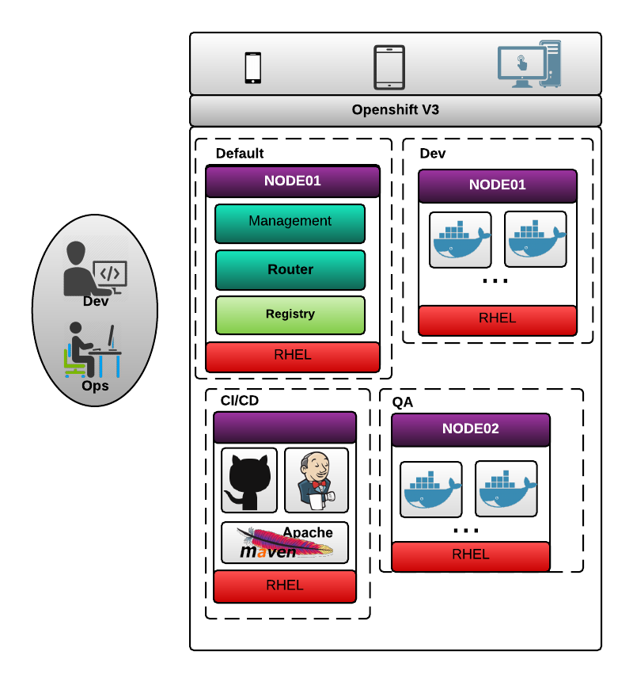

= Guide to Devops using Openshift V3

== Objective
On the final of this guide, you will have a integrated
environment using openshift.

* Gitlab (Git Server)
* Maven Nexus
* Jenkins

== Prerequisites
This guide assume that you know the basics openshift concepts.
If not, check the http://github.com/openshift/training

== Accessing remotely
NOTE: Evict to execute commands inside the nodes (mainly on master node).
The default user on master is system:admin (oc whoami), so is recommended to
connect on openshift as a normal user.

Download the client: https://access.redhat.com/downloads/content/290/ver=3.0.0.0/rhel---7/3.0.2.0/x86_64/product-downloads

== Environment
In my case, I created three virtual machines:

* node01 (master) - 3Gb memory - 2 Cpu
* node02 - 3Gb memory - 2 cpu
* node03 - 3Gb memory - 2 cpu

=== Domain
* In this guide the domain is: *devops.org*

* The openshift apps will use *cloud.devops.org*

So for a jenkins application the url will follow the syntax:

<app>-<project>.<openshift-domain> ->
jenkins-cidi.cloud.devops.org

== Projects
This guide use three projects, simulating *dev*, *qa* and *cidi* environments.

== Create projects

  oc new-project dev --display-name='Development'
  oc new-project qa --display-name='Quality Assurance'
  oc new-project cidi --display-name='Continuous Integration & Delivery'

== Topology (Regions and Zones)

  oc label --overwrite node master.devops.org region="infra" zone="default"
  oc label --overwrite node node02.devops.org region="hmg" zone="primary"
  oc label --overwrite node node01.devops.org region="dsv" zone="primary"

== Volumes
Volume instructions in this guide, use link:create-storage.sh[]
script to create nfs, persistence volume and persistence volume claim.
If you prefer to create without the scripts, the files .yaml is available
on each directory.

It can be created using:

  oc create -f <file>

== link:nexus/README.adoc[Nexus Instructions]
== link:gitlab/README.adoc[Gitlab Instructions]
== link:jenkins/README.adoc[Jenkins Instructions]
