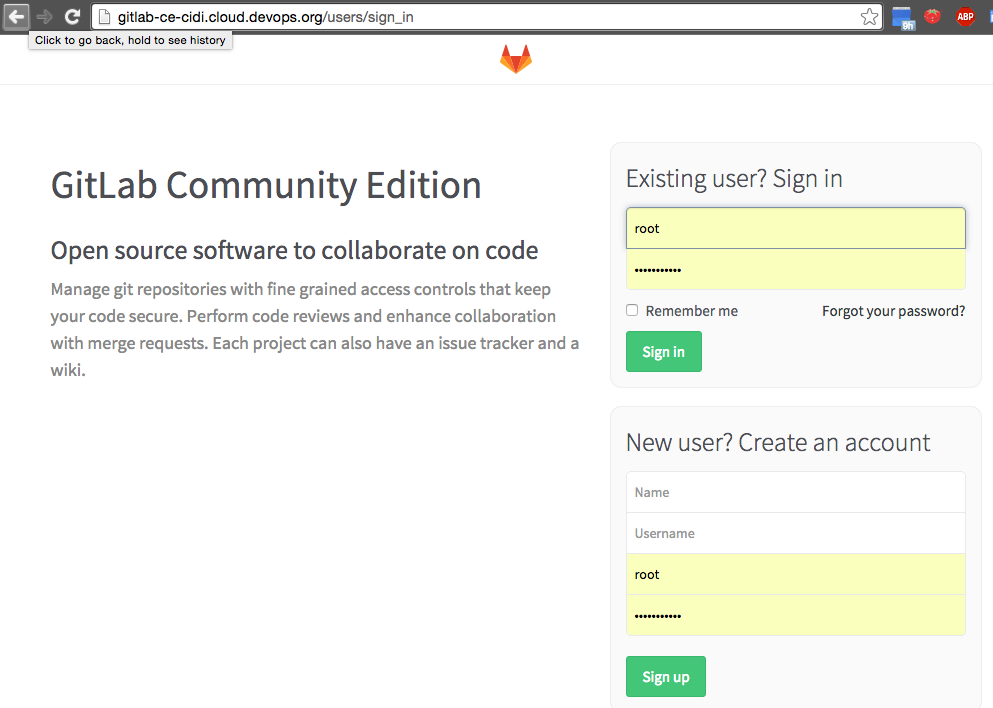
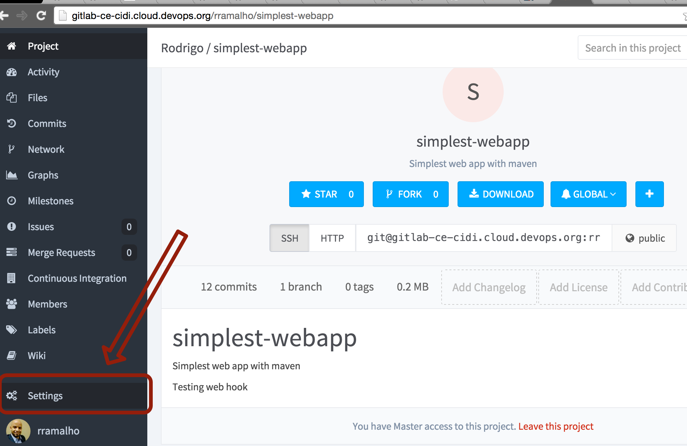
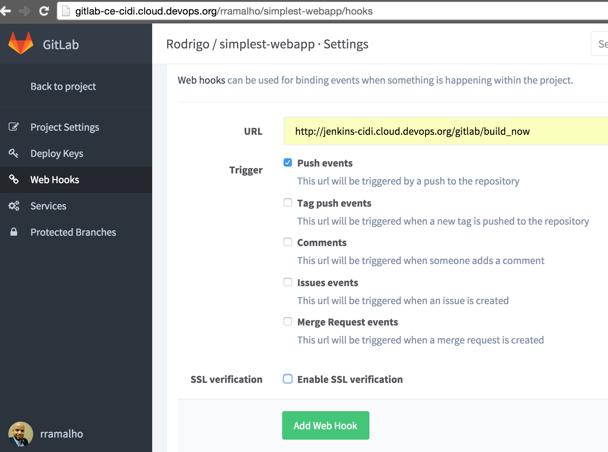
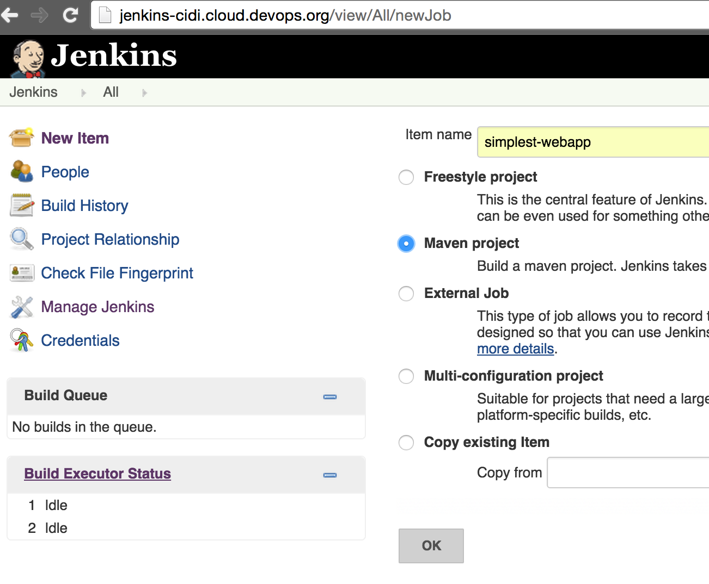
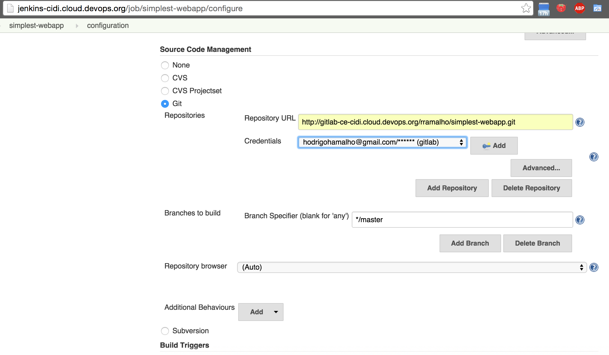
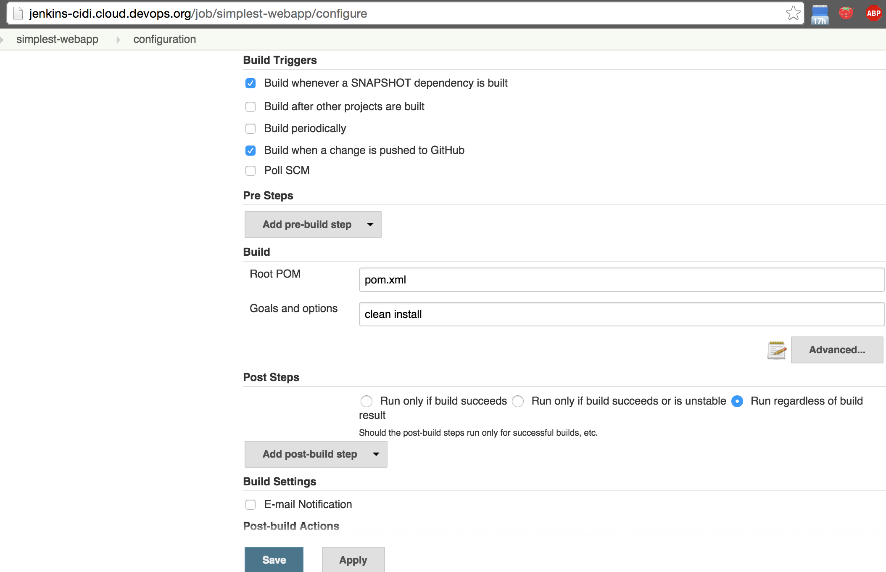

= Gitlab

Execute the steps above with a *non root* user.
Preferably accessing it remotely using openshift client.

== Creating from dockerhub image
  oc new-app gitlab/gitlab-ce:8.0.3-ce.1 -l 'region=cidi,app=gitlab-ce'

== Expose service to external access
  oc expose service gitlab-ce

== Volumes

Inside the node *master*, with *root* execute:

=== Creating NFS/PV and PVC
  ./create-nfs-storage gitlab-log 2 cidi
  ./create-nfs-storage gitlab-etc 1 cidi
  ./create-nfs-storage gitlab-opt 10 cidi

After that the result of *showmount -e* should be something like

  [root@master ~]# showmount -e
  Export list for master.devops.org:
  /var/export/gitlab-log     *
  /var/export/gitlab-opt     *
  /var/export/gitlab-etc     *

=== Bound volumes to Gitlab
With a *non-root* user execute:

  oc volume dc/gitlab-ce --add --overwrite -t persistentVolumeClaim \
  --claim-name=claim-gitlab-etc --name=gitlab-ce-volume-1

  oc volume dc/gitlab-ce --add --overwrite -t persistentVolumeClaim \
  --claim-name=claim-gitlab-log --name=gitlab-ce-volume-2

  oc volume dc/gitlab-ce --add --overwrite -t persistentVolumeClaim \
  --claim-name=claim-gitlab-opt --name=gitlab-ce-volume-3

== Setting external_url
Remember to replace the url domain to yours.

=== Join on container

  oc exec -it gitlab-ce-4-hr71q /bin/sh

=== Add external url content to gitlab.rb file

  echo "external_url 'http://gitlab-ce-cidi.cloud.devops.org'" >> /etc/gitlab/gitlab.rb

=== Restart gitlab

  gitlab-ctl reconfigure

== Github Integration

  http://doc.gitlab.com/ce/integration/github.html

==== Solving 502 error

Openshift balancer send requests to sshd gitlab service,
so one request return success (200), the next request error (502).
To solve it, remove sshd port from service.

 sudo edit svc gitlab-ce

Content to be erased (something like):

  ports:
    - name: 22-ssh
      nodePort: 0
      port: 22
      protocol: TCP
      targetPort: 0

== Enjoy your Gitlab Repository

http://gitlab-ce-cidi.cloud.devops.org/

* User: root
* Password: 5iveL!fe

== Integration with Jenkins
. Create a new repository called simplest-webapp
  http://gitlab-ce-cidi.cloud.devops.org/projects/new
. Clone github repository on your local machine https://github.com/hodrigohamalho/simplest-webapp

  cd simplest-webapp
  rm -rf .git
  git init
  git add .
  git commit -am 'Uploading simplest-webapp project'
  # Change the domain and username from url
  git remote add origin http://gitlab-ce-cidi.cloud.devops.org/rramalho/simplest-webapp
  git push origin master

. Configure Web Hook
It will notify Jenkins whenever a commit is maded on this project

=== Jenkins
Create a maven project pointing to gitlab project.

=== Testing
On your simplest-webapp directory make any modification and commit/push.

  cd simplest-webapp
  echo "Testing integration (please work, please...)" >> README.adoc
  git commit -am 'Testing integration'
  git push origin master

Look at jenkins dashboard, project should be bulding.

=== Useful links:

* https://gitlab.com/gitlab-org/omnibus-gitlab/blob/629def0a7a26e7c2326566f0758d4a27857b52a3/README.md#configuring-the-external-url-for-gitlab
* https://hub.docker.com/r/gitlab/gitlab-ce/
* https://gitlab.com/gitlab-org/omnibus-gitlab/blob/master/doc/docker/README.md
* http://doc.gitlab.com/ce/integration/github.html
* https://help.github.com/articles/adding-an-existing-project-to-github-using-the-command-line/
