= Jenkins

== Creating from dockerhub image

=== Jenkins (Redhat registry)

  oc new-app jenkins-1-rhel7 -l \
             -e "JENKINS_PASSWORD=redhat" \
             -l "region=cidi,app=jenkins-redhat"

=== Jenkins (docker.io registry)

  oc new-app docker.io/jenkins \
             -l "region=cidi,app=jenkins"

=== Expose service to external access

If you choose from Red Hat registry:

  oc expose service jenkins-1-rhel7

From docker.io:

  oc expose service jenkins

== Volumes

Inside the node *master*, with *root* execute:

=== Creating NFS/PV and PVC
  ./create-nfs-storage jenkins 5 cidi

After that the result of *showmount -e* should be something like

  [root@master ~]# showmount -e
  Export list for master.devops.org:
  /var/export/jenkins     *

=== Bound volumes to Jenkins (Red Hat)
With a *non-root* user execute:

  oc volume dc/jenkins-1-rhel7 \
            --add --overwrite -t persistentVolumeClaim \
            --claim-name=claim-jenkins \
            --name=jenkins-1-rhel7-volume-1

=== Bound volumes to Jenkins (From docker.io)
With a *non-root* user execute:

  oc volume dc/jenkins \
            --add --overwrite -t persistentVolumeClaim \
            --claim-name=claim-jenkins \
            --name=jenkins-volume-1

== Configuration
http://jenkins-1-rhel7-cidi.cloud.devops.org/configure

=== Plugins
Access plugins url: http://jenkins-cidi.cloud.devops.org/pluginManager/available

* On filter type: *github*
* Select *Github client*

=== Global configuration
Access configuration url: http://jenkins-cidi.cloud.devops.org/configure

==== ADD JDK

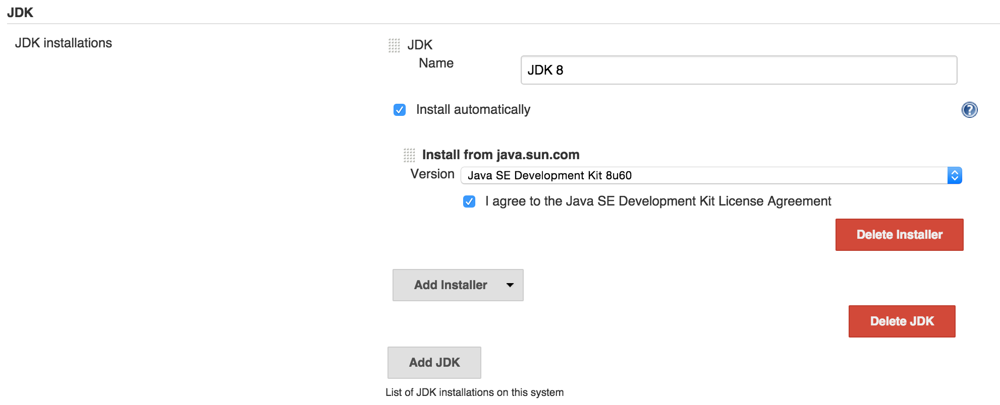

==== ADD GIT

==== ADD MAVEN

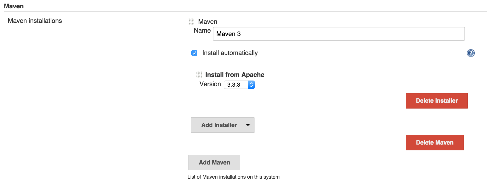

== Fixing bugs
=== Remove port 5000 from service
  oc edit service jenkins

== Testing

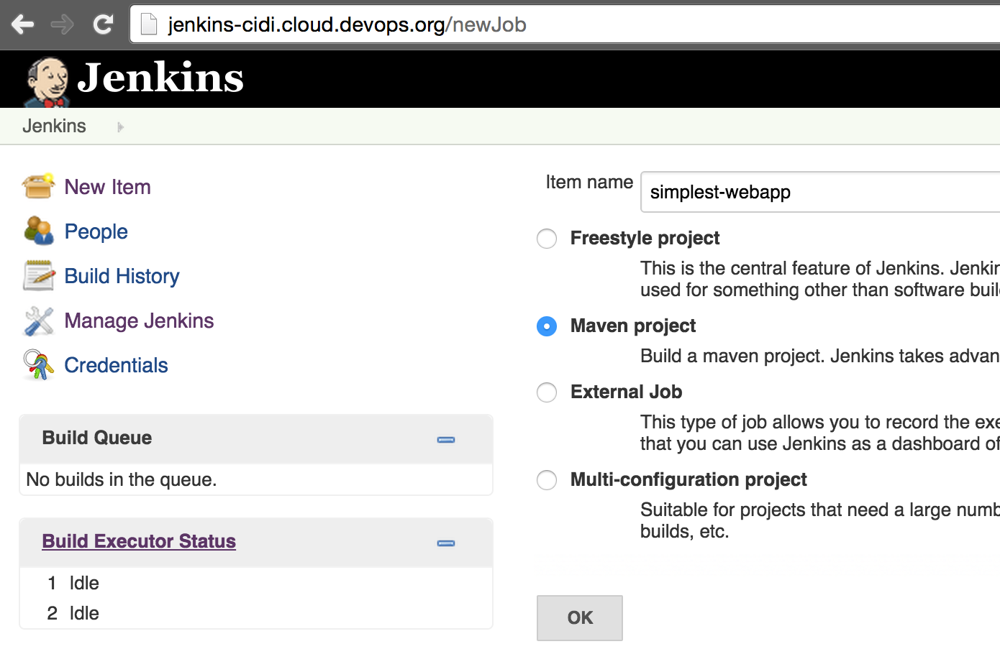
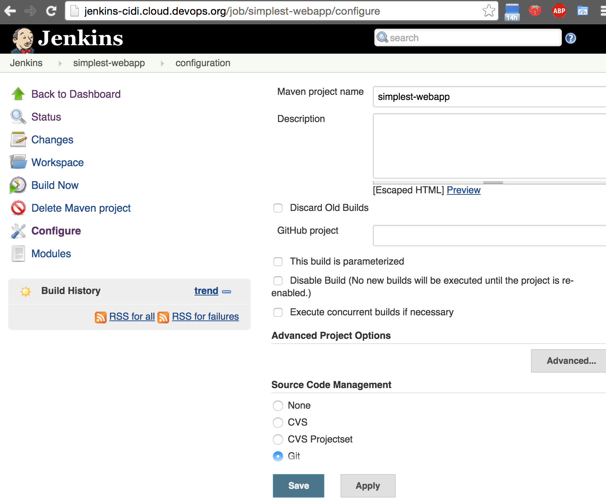
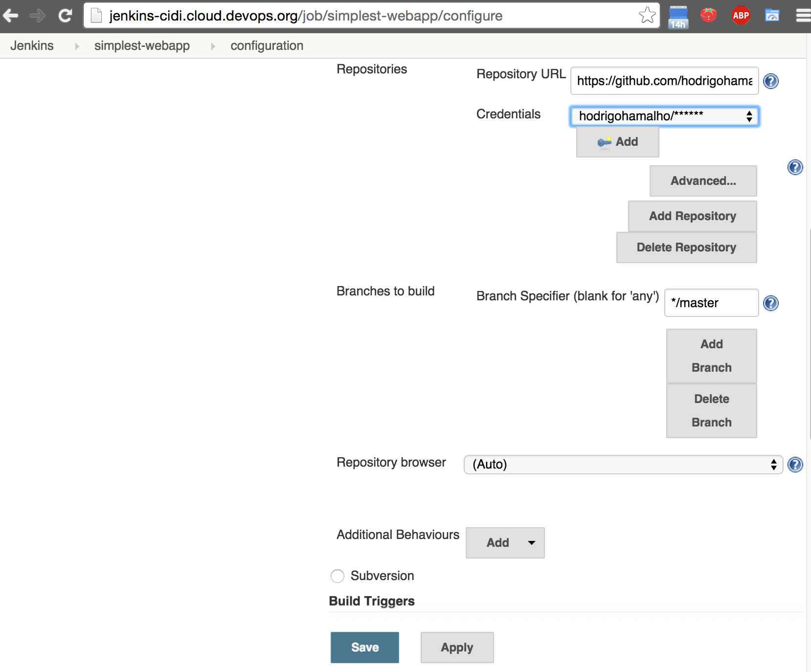
image::images/jenkins-creatingapp4.png[]
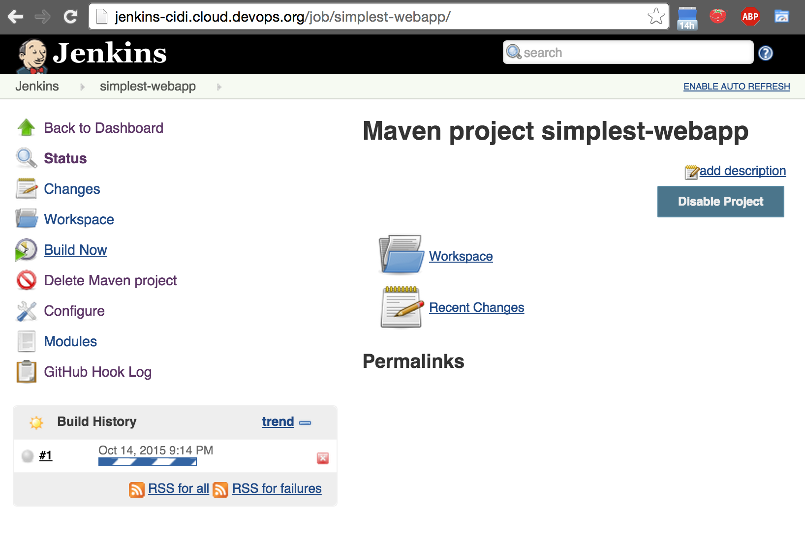
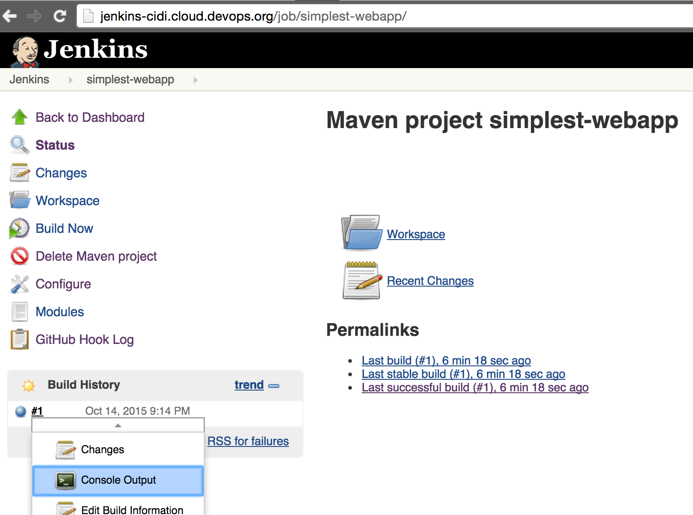
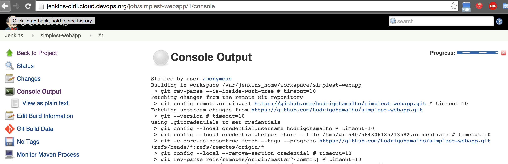
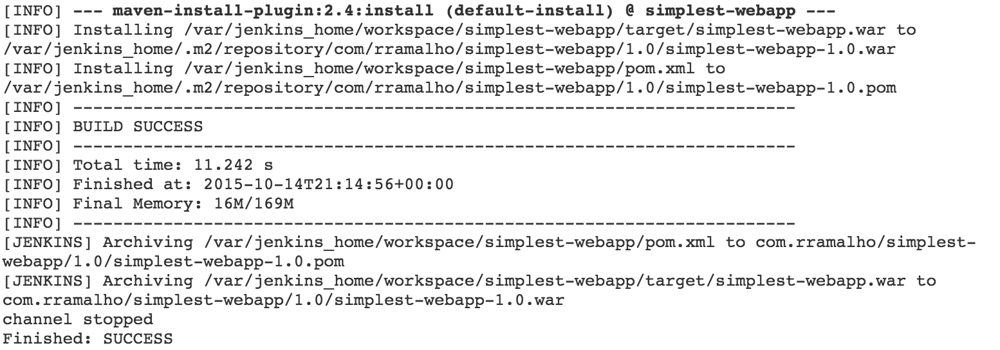
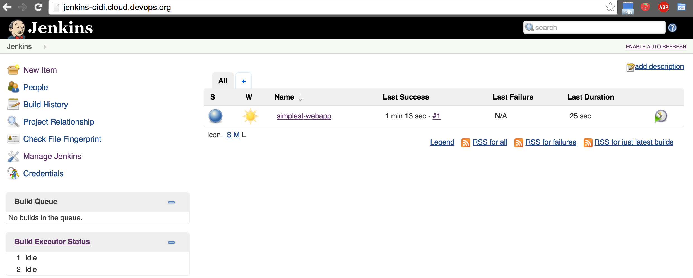

== Integration with Nexus
To enable jenkins to use nexus to manage components on build proccess,
you must point maven configuration to use link:settings.xml[]

On Master node:

cp settings.xml /var/export/jenkins/

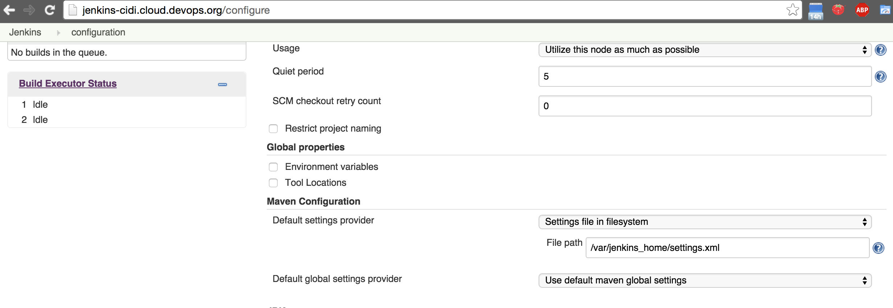

The file path is different because it is relative to the mapping inside the container.

== Useful links

* https://github.com/openshift/jenkins
* https://hub.docker.com/_/jenkins/
