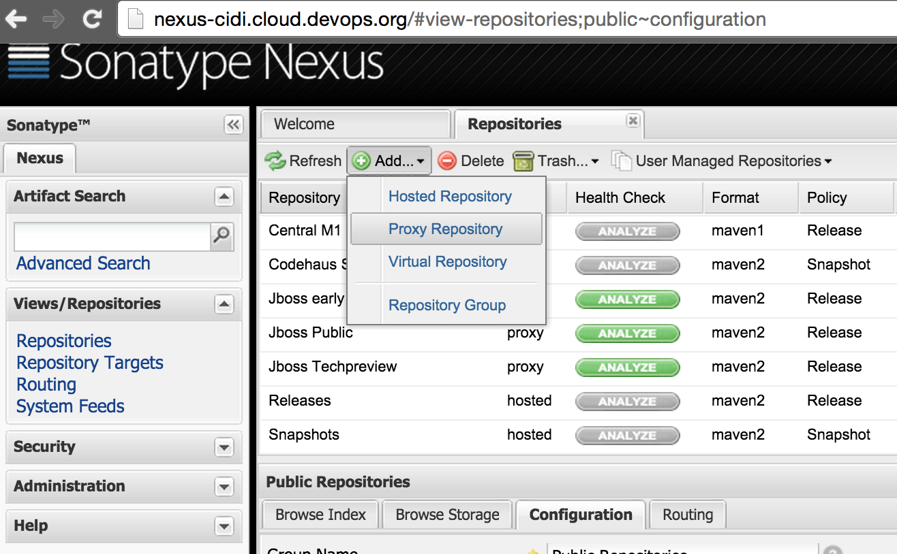
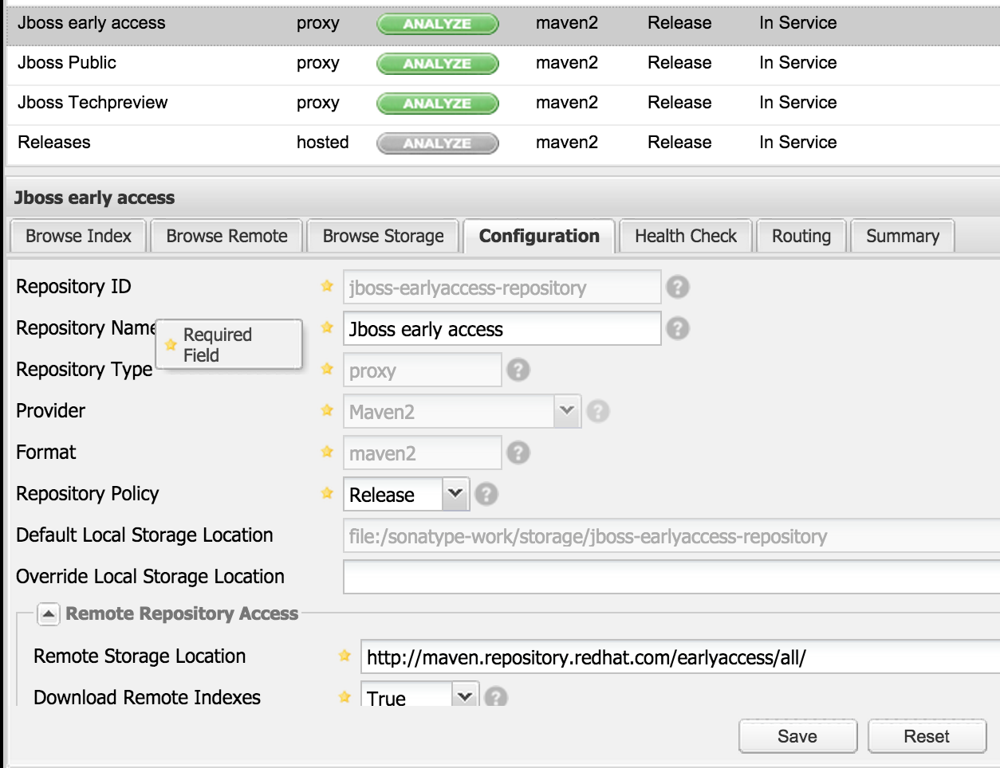
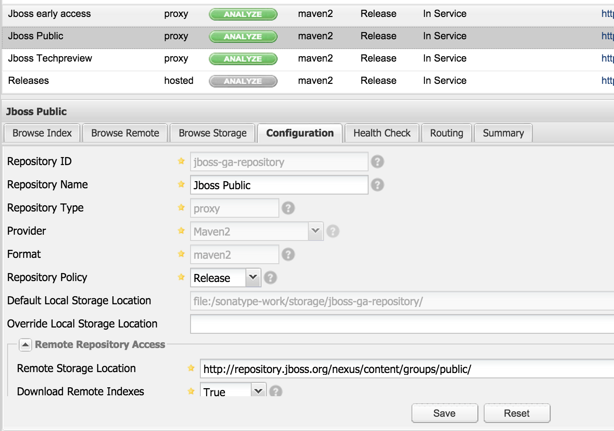
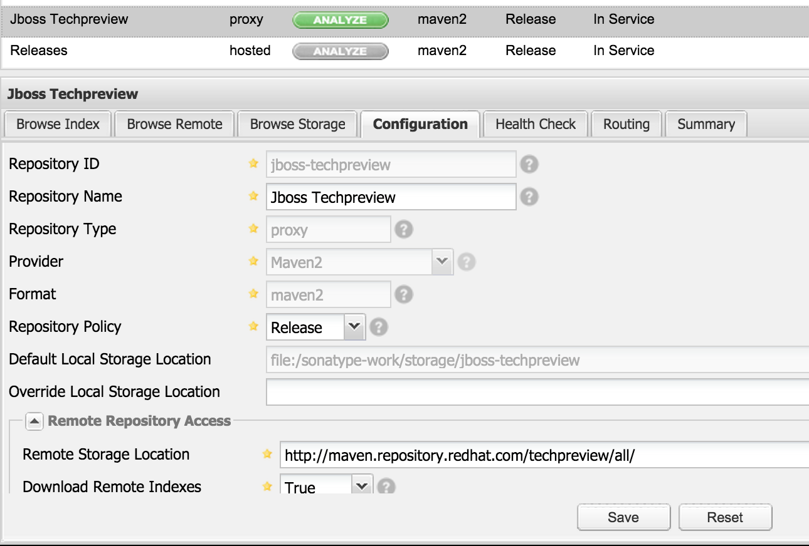
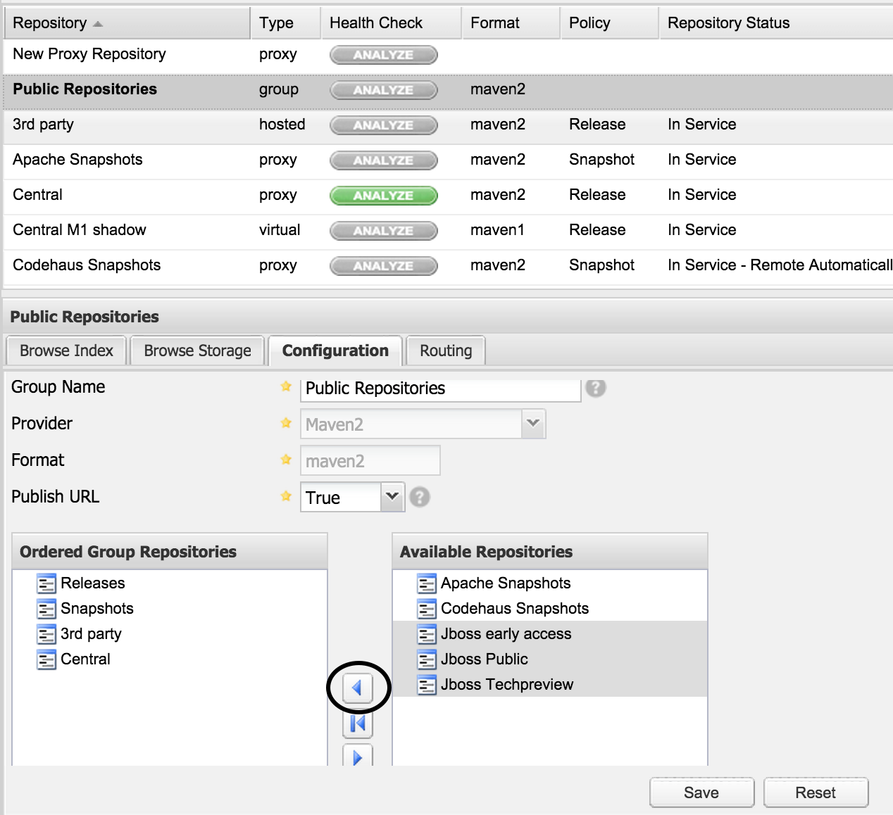
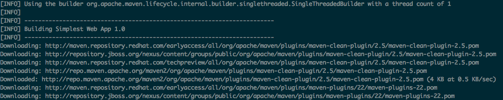

= Nexus

== Creating from dockerhub image
  oc new-app sonatype/nexus -l \
             'region=cidi,app=nexus'

==== Expose service to external access
  oc expose service nexus

== Volumes

Inside the node *master*, with *root* execute:

=== Creating NFS/PV and PVC
  ./create-storage.sh nexus 15 cidi

After that the result of *showmount -e* should be something like

  [root@master ~]# showmount -e
  Export list for master.devops.org:
  /var/export/jenkins     *

=== Bound volumes to Nexus
With a *non-root* user execute:

  oc volume dc/nexus \
          --add --overwrite -t persistentVolumeClaim \
          --claim-name=claim-nexus --name=nexus-volume-1

The container(POD) will be redeployed.

== Configuration
http://nexus-cidi.cloud.devops.org/

* Login: admin
* Password: admin123

=== Add JBoss repositories
On *Repositories* menu

=== Click on Proxy Repository

=== Add Early Access Repository

* Repository ID: jboss-earlyaccess-repository
* Repository Name: Jboss Early Access
* Remote Storage Location: http://maven.repository.redhat.com/earlyaccess/all/

=== Add Jboss Public Repository

* Repository ID: jboss-ga-repository
* Repository Name: Jboss Public
* Remote Storage Location: http://repository.jboss.org/nexus/content/groups/public/

=== Add Jboss Techpreview Repository

* Repository ID: jboss-techpreview
* Repository Name: Jboss Techpreview
* Remote Storage Location: http://maven.repository.redhat.com/techpreview/all/

=== Add Jboss Repositories to Public

== Maven configuration (Developers Machine)

All developers should put the file link:settings.xml[] in directory:
*~/.m2/*

== Testing

  git clone https://github.com/hodrigohamalho/simplest-webapp
  cd simplest-webapp
  mvn clean install

The libs must be downloaded from your nexus server.

